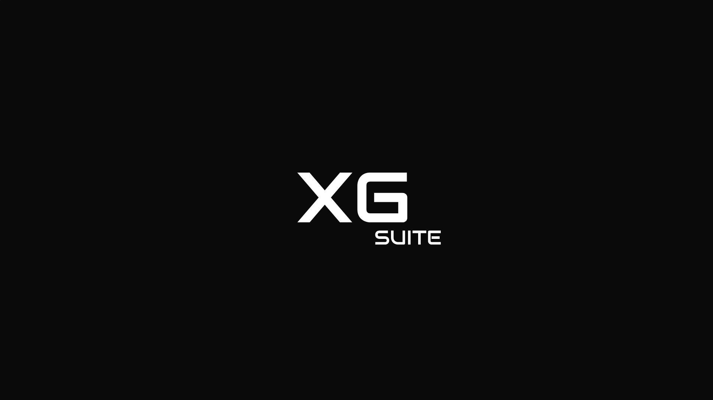

# XrmGhost

  

Modern development tools for **Microsoft Dataverse** and **Dynamics 365**.

XrmGhost helps teams accelerate delivery with local testing, reusable test scenarios, workflow automation, and developer-focused runtime tooling.

  

## What XrmGhost is about

- **Supercharge the development workflow** from local machine to cloud delivery
- **Code and test locally** instead of relying on slow deploy-and-test loops
- **Build reproducible Dataverse test scenarios** to validate bugs, edge cases, and regressions faster

## Organization status

This GitHub organization is being opened progressively as repositories and products go live.

- some repositories are already public-facing
- others are still being cleaned up for broader external consumption
- each repository README should be treated as the source of truth for scope, maturity, and usage guidance

## What you'll find here

- product repositories
- platform and runtime components
- shared contracts and client libraries
- infrastructure and delivery assets
- technical documentation and public-facing material

## Start here

- Explore the public repositories in this organization
- Read each repository README to understand purpose, boundaries, and current status
- Follow XrmGhost as more tooling, docs, and public artifacts go live

We are building for teams working seriously on the Microsoft Dataverse and Dynamics 365 stack.
