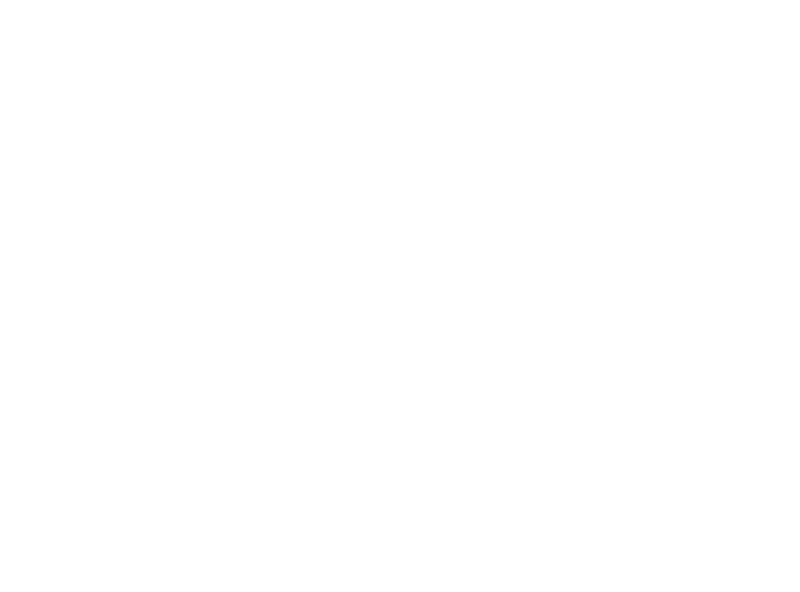

# XrmGhost

  <picture>
    <source media="(prefers-color-scheme: dark)" srcset="./assets/XG_Audiowide_transparent_negative.svg">
    <source media="(prefers-color-scheme: light)" srcset="./assets/XG_Audiowide_transparent.svg">
    
  </picture>

**Local-first, agent-native development for the Microsoft Power Platform.**
 
We think the way Dynamics plugins get built today is broken. You write code, deploy, wait, test, fail, redeploy — minutes lost on every iteration, bugs found in production instead of on your machine. XrmGhost exists to end that loop: plugins run locally, your AI agent writes and validates them, and what ships already works.
 
That belief shapes everything we build. Local execution over deploy-and-pray. The agent as the primary interface, the CLI as the second. Bugs caught before they exist, not after a customer reports them.
 
XrmGhost comes out of two decades building on the Dynamics stack. The loop it fixes isn't theoretical — it's one its author lived, daily, for years.
 
## The pieces
 
A few components live here in the open — the things you can reference, read, or build against. The product's core stays private for now. Each public repository's README is the source of truth for what it does and how mature it is.
 
## Where this is going
 
The workflow is moving closer to where developers already work — deeper into the IDEs and tooling used every day, so local-first plugin development stops being a separate step and becomes part of the normal flow.
 
## Where to go

This profile is an index, not the story — each destination below owns its own detail.

| Surface | What you'll find there |
|---|---|
| **[www.xrmghost.tech](https://www.xrmghost.tech)** | Product overview and positioning — start here if you're evaluating XrmGhost. |
| **[docs.xrmghost.tech](https://docs.xrmghost.tech)** | Getting-started guides and reference docs for using the CLI day to day. |
| **[xrmghost/xrmghost](https://github.com/xrmghost/xrmghost)** | The main public repo — issues, feature requests, and release notes live here. |
| **[xrmghost/xrmghost-skills](https://github.com/xrmghost/xrmghost-skills)** | Agent skills for running and debugging Dataverse/Dynamics 365 plugins locally with the CLI. |
| **[xrmghost/xrmghost-attributes](https://github.com/xrmghost/xrmghost-attributes)** | Declarative attributes library for Dataverse plugin development — decorate a class, skip the plumbing. |
| **[xrmghost/xrmghost-docs](https://github.com/xrmghost/xrmghost-docs)** | Source of the documentation site, if you want to read it as Markdown or open a docs issue. |

---
 
© 2026 XrmGhost
